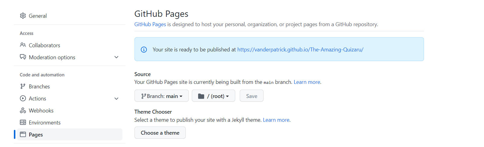

# The Amazing Quizaru

## By Patrick Alexander Lucas Van Der Flier

### [Check The Amazing Quizaru](https://vanderpatrick.github.io/The-Amazing-Quizaru/)
### [Check my Repository](https://github.com/vanderpatrick/The-Amazing-Quizaru/)

# The Amazing Quizaru :

### The Amazing Quizaru was developed by me as my second Full Stack Web Development project with Code Institute.

# Reason :
The Amazing Quizaro was developed with the porpuse of giving more information about the skate universe in a funny and interactive way. By playing this quiz you gonna learn some usefull information about some skate legends and also some hidden rules to make your skateboarding experience much better.

# The user Experience (UX)

##  Audience : 

- People who to learn more about skating.
- Skaters that want to test ther knowladge about skate facts.
- skaters who wish to spend some time in a fast and funny game.

## User Report : 

- first experience

    1. As a user I would like instructions to know how to play.
    2. As a user I would like easy way to navigate in the website.
    3. As a user I would like to imidiatly play the game.

- Second experience

    1. I would want to re-test my knowladge.
    2. I would want to all answers correct.
    3. I would want to who made the game.

- As a developer    
    
    1. I want to make the interactive.
    2. I want to make the site have a direct image about what you can do. 
    3. I want to give a good time with interessting questions about the skate universe that you probaly dont know.

# Testing :

This is a HTML CSS and JS web site, my main consaern in the project was the logic apllyed to the quiz.

 - The project was built with a desktop approach, Because it was easier for me to create the content in the page.

 - It was hard to fix the Js bugs in all HTML pages. But in the end no relevants errors nor bugs.

 # Test Validators :

## Here you have acces to all HTML validators from all 5 pages:
 
 ## [HTML Validator - Index](https://validator.w3.org/nu/?doc=https%3A%2F%2Fvanderpatrick.github.io%2FThe-Amazing-Quizaru%2Findex.html)
 ## [HTML Validator - Quiz_box](https://validator.w3.org/nu/?showsource=yes&doc=https%3A%2F%2Fvanderpatrick.github.io%2FThe-Amazing-Quizaru%2Fquiz_box.html#textarea)
 ## [HTML Validator - Help](https://validator.w3.org/nu/?showsource=yes&doc=https%3A%2F%2Fvanderpatrick.github.io%2FThe-Amazing-Quizaru%2Fhelp.html#textarea)
 ## [HTML Validator - Credits](https://validator.w3.org/nu/?showsource=yes&doc=https%3A%2F%2Fvanderpatrick.github.io%2FThe-Amazing-Quizaru%2Fcredits.html)
 ## [HTML Validator - Result](https://validator.w3.org/nu/?showsource=yes&doc=https%3A%2F%2Fvanderpatrick.github.io%2FThe-Amazing-Quizaru%2Fcredits.html#textarea)

All Html pages have been tested and passed with success and irellevent warnings.

 ## [Jigsaw CSS Validator](https://jigsaw.w3.org/css-validator/validator?uri=https%3A%2F%2Fvanderpatrick.github.io%2FThe-Amazing-Quizaru%2F&profile=css3svg&usermedium=all&warning=1&vextwarning=&lang=en)

The CSS file has been tested and passed with success.

##[JavaScript Validator]()

# Deployment :
 ## This project was deployed to GitHub. Instructions on how to deploy bellow :
  - In the GitHub repository go to settings.
  

  - In the settings tab click the page button.
  

  - Change the none button to the main.
  
  
  - Click save and then check your link URL.
  