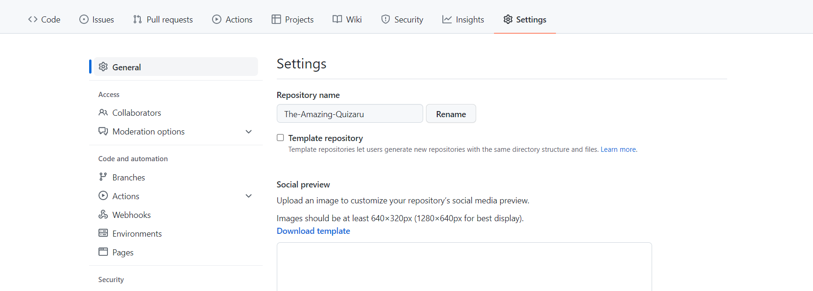
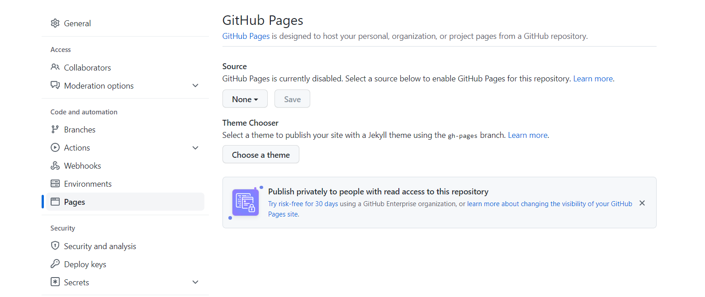

# The Amazing Quizaru

## By Patrick Alexander Lucas Van Der Flier

### [Check The Amazing Quizaru](https://vanderpatrick.github.io/The-Amazing-Quizaru/)

# The Amazing Quizaru :

### The Amazing Quizaru was developed by me as my second Full Stack Web Development project with Code Institute.

# Reason :
The Amazing Quizaro was developed to give more information about the skate universe in an funny and interactively way. By playing this quiz you gonna learn some useful information about some skate legends and also some hidden rules to make your skateboarding experience much better.

# The user Experience (UX)

##  Audience : 

- People who want to learn more about skating.
- Skaters that want to test their knowledge about skate facts.
- skaters who wish to spend some time in a fast and funny game.

## User Report : 

- first experience

    1. As a user I would like instructions to know how to play.
    2. As a user I would like an easy way to navigate the website.
    3. As a user I would like to immediately play the game.

- Second experience

    1. I would want to re-test my knowledge.
    2. I would want all answers correct.
    3. I would want to know who made the game.

- As a developer    
    
    1. I want to make it interactive.
    2. I want the site to have an direct image of what you can do. 
    3. I want to give a good time with interesting questions about the skate universe that you probably didn't knew.

# Features :

The Features were designed to distinguish each area with ease so the user can explore the site instinctively.

- Navigation bar
    - The navigation bar is featured on all HTML pages being responsive for big, medium, and small devices.
    - It consists of 3 clickable links that redirect in the same tab to the other pages. 
    - The Header act as a link to the home page.
    - as it shrinks the navigations links (Home, How to, Credits) turn into a burger-styled menu.

 

- Landing page
    - The homepage consists of 3 interactable options for the player, he(she) can start the game, see the credits, or see instructions.
    - it is easy to look at and intuitive to chose what to do.

- Footer
    - Simple footer, not much to see, just enough social media links if the user wants to check my other work.
    

- Quiz section
    - The quiz section gives the player 10 questions with 4 options.
    - The user cannot proceed until one of the options is chosen.
    - After the user clicks on an option if right it turns to green and the next button shows up.
    - If wrong all wrong options turn to red and the correct one to green.
    - Then the next button shows to the user so he(she) can move forward.

- Quiz result
    - The result section shows the number of correct answers from total questions.
    - the user has the option to restart the game or exit the game.

# Testing :

This is an HTML CSS and JS website, my main concern in the project was the logic applied to the quiz.

 - The project was built with a desktop approach Because it was easier for me to create the content on the page.

 - It was hard to fix the Js bugs in all HTML pages. But in the end it passed all tests.

 # Test Validators :

## Here you have access to all HTML validators from all 5 pages:
 
 ## [HTML Validator - Index](https://validator.w3.org/nu/?doc=https%3A%2F%2Fvanderpatrick.github.io%2FThe-Amazing-Quizaru%2Findex.html)
 ## [HTML Validator - Quiz_box](https://validator.w3.org/nu/?showsource=yes&doc=https%3A%2F%2Fvanderpatrick.github.io%2FThe-Amazing-Quizaru%2Fquiz_box.html#textarea)
 ## [HTML Validator - Help](https://validator.w3.org/nu/?showsource=yes&doc=https%3A%2F%2Fvanderpatrick.github.io%2FThe-Amazing-Quizaru%2Fhelp.html#textarea)
 ## [HTML Validator - Credits](https://validator.w3.org/nu/?showsource=yes&doc=https%3A%2F%2Fvanderpatrick.github.io%2FThe-Amazing-Quizaru%2Fcredits.html)
 ## [HTML Validator - Result](https://validator.w3.org/nu/?showsource=yes&doc=https%3A%2F%2Fvanderpatrick.github.io%2FThe-Amazing-Quizaru%2Fcredits.html#textarea)

All Html pages have been tested and passed with success with irrelevant warnings.

 ## [Jigsaw CSS Validator](https://jigsaw.w3.org/css-validator/validator?uri=https%3A%2F%2Fvanderpatrick.github.io%2FThe-Amazing-Quizaru%2F&profile=css3svg&usermedium=all&warning=1&vextwarning=&lang=en)
 - For responsiveness, this project was tested in the desktop level, laptops, tablets(iPad), telephones, all screen sizes have shown responsiveness

The CSS file has been tested and passed with success.

## JavaScript Validator :
- The code was tested numerous times and didn't show any bugs in the final code.
- the undefinable variables are objects from an array.

# Deployment :
 ## Remote Deployment :
  - In the GitHub repository go to settings.
  

  - In the settings tab click the page button.
  

  - Change the none button to the main.
  
  
  - Click save and then check your link URL.
  

## How to fork :
  - In the repository that you want to fork, go to the right upper corner and click fork.
  
  - After "forking" wait while GitHub copies the repository into your profile.
  
## Desktop Deployment :
  - In the repository click on code.
  
  - Click at download zip file.
  
  - When that is done, open with your chosen code program. 

  # External Features :
  ### In the links below, you will find all the icons and fonts used in the project. 

- [Google Fonts](https://fonts.google.com/)
  - Was used to select the font combination for this project.
- [Font Awesome](https://fontawesome.com/)
  - Was used to select the icons used in this project. 

  # Credits :
 1. [Web Dev Simplified](https://www.youtube.com/channel/UCFbNIlppjAuEX4znoulh0Cw)
  - For helping me again with my nav bar and also with a lot of useful js videos.

 2. [CodingNepal](https://www.youtube.com/c/CodingNepal/featured)
  - CodingNepal was my stepping stone to make this quiz project.
  
 3.  [Code Institute](https://codeinstitute.net/)
  - Code Institute for all the suporte and care with me and my projects.

  ## Special thanks 
  I would like to thank everyone who helped me with this project.

- My mentor.
- Jean my good French friend for all the support and advice.
- Code Institute for giving the best support to develop this project.
